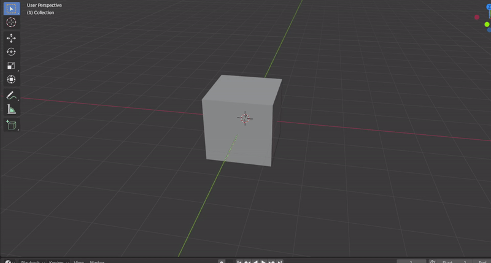
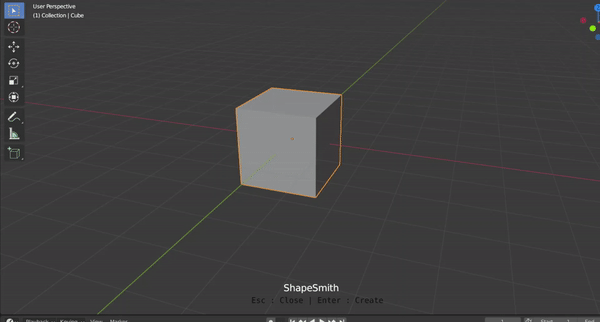

# ShapSmith

### Freeform and Guided Shape Maker for Blender

Change "guided_shape_maker" from init file to "freeform_shape_maker" for freeform edits.

## 1. You can add Freeform Shapes anywhere in the viewport.

## 2. You can also use any one of the faces in your scene to act as a guide for making a new shape.
